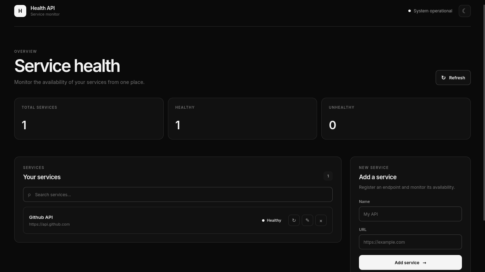
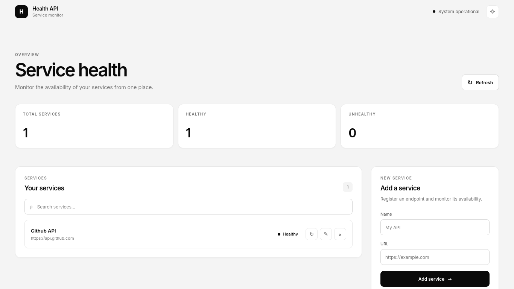
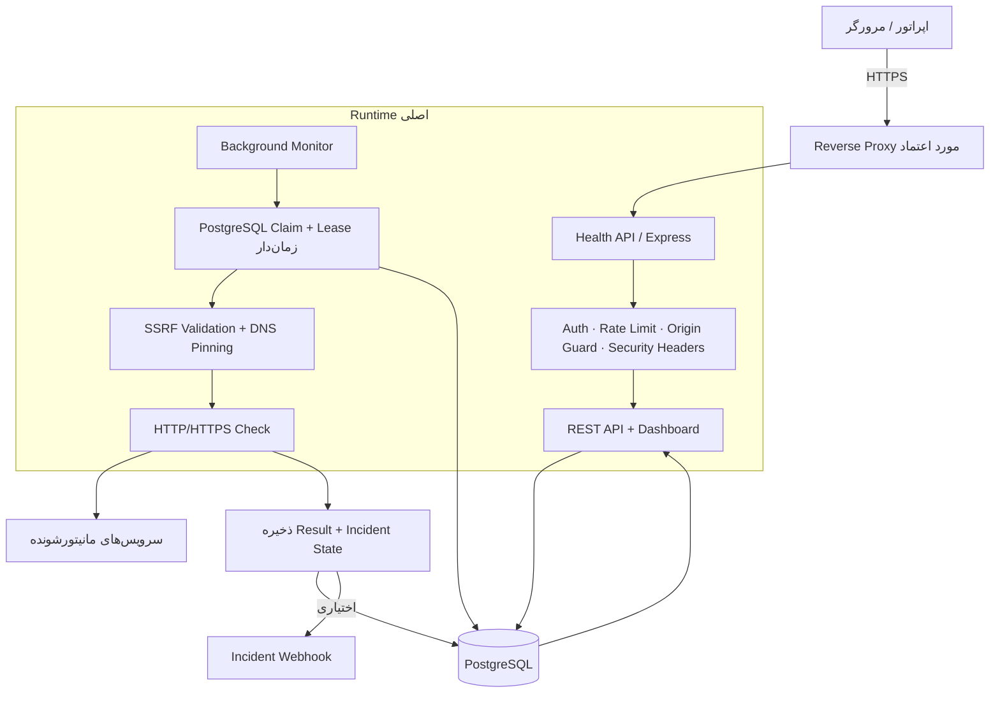
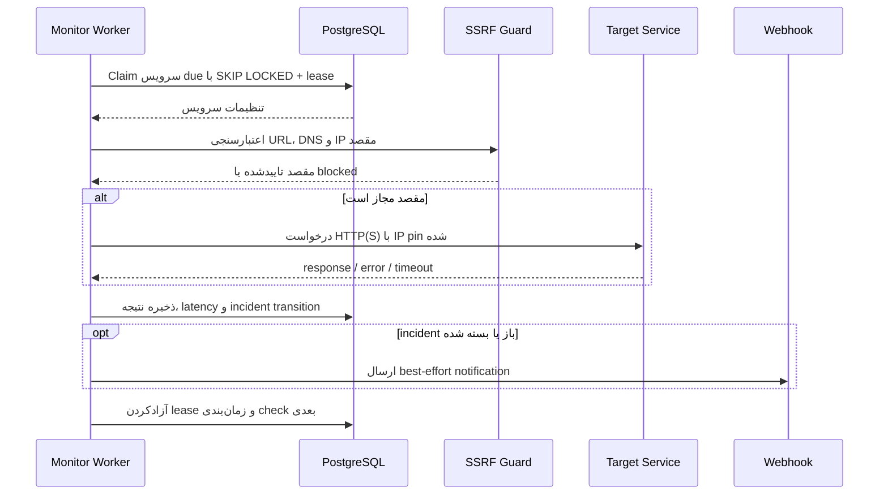

<div align="center">

# Health API — راهنمای فارسی

**مانیتورینگ مداوم سرویس‌های HTTP/HTTPS با Dashboard، تاریخچه PostgreSQL، Incident Tracking و کنترل‌های امنیتی مناسب Production.**


[🇮🇷 فارسی](README-FA.md) · [🌍 English](README.md)

</div>

## داشبورد

اسکرین‌شات‌های اصلی خود پروژه حفظ شده‌اند و Dashboard هم Dark Mode و هم Light Mode دارد.

<p align="center">
  <table>
    <tr>
      <td align="center" width="50%">
        <strong>حالت تاریک</strong><br>
        
      </td>
      <td align="center" width="50%">
        <strong>حالت روشن</strong><br>
        
      </td>
    </tr>
  </table>
</p>

## چرا Health API؟

ساختن یک endpoint برای Health Check ساده است؛ ساختن یک سیستم مانیتورینگ که در Production امن، قابل اتکا و قابل نگهداری باشد ساده نیست.

Health API دقیقاً برای همین فاصله طراحی شده:

- سرویس‌ها را مداوم و زمان‌بندی‌شده بررسی می‌کند؛
- وضعیت، latency، تاریخچه و incidentها را در PostgreSQL نگه می‌دارد؛
- در چند instance از اجرای check تکراری جلوگیری می‌کند؛
- URL مقصد را ورودی غیرقابل‌اعتماد فرض می‌کند و جلوی SSRF و DNS rebinding را می‌گیرد؛
- خواندن وضعیت ذخیره‌شده را از live check جدا می‌کند؛
- liveness، readiness، metrics، log ساختاریافته و webhook incident دارد؛
- همراه با CI، CodeQL، Docker hardening، migration، Runbook، ADR و Threat Model ارائه می‌شود.

## معماری در یک نگاه



اصل مهم طراحی این است که Dashboard فقط **وضعیت ذخیره‌شده** را می‌خواند و برای هر سرویس هنگام render یک outbound request جدید ایجاد نمی‌کند.

برای دیدن تمام دیاگرام‌های Runtime، Deployment، Incident، Data و CI/CD برو به **[docs/DIAGRAMS.md](docs/DIAGRAMS.md)**.

## چرخه کامل مانیتورینگ



## چه چیزهایی داخل پروژه است؟

| بخش | پیاده‌سازی |
|---|---|
| Monitoring | Background scheduler، bounded concurrency و manual check |
| Coordination | `FOR UPDATE SKIP LOCKED` + lease زمان‌دار در PostgreSQL |
| History | تاریخچه status، status code، latency و retention |
| Incidents | failure threshold، lifecycle باز/بسته و invariant یک incident باز |
| Security | Basic Auth، rate limit، origin guard و security headerها |
| SSRF | محدودیت HTTP(S)، بلاک IPهای special/private، redirect re-validation و DNS pinning |
| Operations | `/live`، `/ready`، `/metrics`، JSON logs، Request ID و graceful shutdown |
| Delivery | Docker hardening، Compose isolation، CI، CodeQL، Dependabot و GHCR |
| Documentation | Architecture، Design Doc، Threat Model، Runbook، ADR و README فارسی |

## شروع سریع

فایل env نمونه را کپی کن:

```bash
cp .env.example .env
```

حداقل این secretها را با مقدار واقعی جایگزین کن:

```text
DB_PASSWORD=<long-random-database-password>
ADMIN_USERNAME=admin
ADMIN_PASSWORD=<at-least-16-characters>
```

سپس:

```bash
docker compose up -d --build
```

Dashboard:

```text
http://localhost:3000/dashboard
```

در Production باید TLS روی reverse proxy یا load balancer مورد اعتماد terminate شود. Basic Auth را روی HTTP ساده در شبکه عمومی expose نکن.

## API اصلی

### Endpointهای عملیاتی

```http
GET /live
GET /ready
GET /health
GET /metrics
```

`/live` فقط process را چک می‌کند. `/ready` اتصال PostgreSQL را هم بررسی می‌کند. `/health` alias سازگار با readiness است و `/metrics` نیازمند authentication است.

### مدیریت سرویس‌ها

```http
GET    /services?limit=100&offset=0&search=payments
POST   /services
GET    /services/:id
PATCH  /services/:id
DELETE /services/:id
```

نمونه سرویس:

```json
{
  "name": "Payments API",
  "url": "https://payments.example.com/health",
  "intervalSeconds": 60,
  "timeoutMs": 5000,
  "expectedStatus": 200,
  "enabled": true
}
```

### وضعیت، check دستی، history و incidents

```http
GET  /services/:id/health
POST /services/:id/check
GET  /services/:id/history?limit=100
GET  /services/:id/incidents?limit=50
```

`GET /services/:id/health` فقط آخرین نتیجه ذخیره‌شده را می‌دهد و **هیچ outbound request جدیدی ایجاد نمی‌کند**. برای check فوری از `POST /services/:id/check` استفاده می‌شود.

## مدل امنیتی

مقصدهای عمومی اینترنت به‌صورت پیش‌فرض مجاز هستند، اما loopback، private، link-local، metadata، multicast، documentation و سایر rangeهای special-use در IPv4/IPv6 بلاک می‌شوند مگر اینکه policy مشخصاً اجازه دهد.

هر redirect دوباره از ابتدا validate می‌شود و اتصال به IPای pin می‌شود که validation را پاس کرده تا ریسک DNS rebinding کم شود.

برای سرویس داخلی مشخص:

```text
TARGET_ALLOWLIST=api.internal.example,*.svc.example
```

قبل از expose کردن سرویس بیرون از محیط توسعه، [SECURITY.md](SECURITY.md) و [docs/THREAT_MODEL.md](docs/THREAT_MODEL.md) را بخوان.

## نقشه مستندات

| سند | کاربرد |
|---|---|
| [README.md](README.md) | راهنمای انگلیسی |
| [docs/DIAGRAMS.md](docs/DIAGRAMS.md) | همه نمودارهای Mermaid شامل Runtime، Data، Incident، Deployment و CI/CD |
| [docs/ARCHITECTURE.md](docs/ARCHITECTURE.md) | معماری و مرز componentها |
| [docs/DESIGN.md](docs/DESIGN.md) | Design goalها، invariantها و trade-offها |
| [docs/THREAT_MODEL.md](docs/THREAT_MODEL.md) | دارایی‌ها، trust boundaryها، تهدیدها و residual risk |
| [docs/OPERATIONS.md](docs/OPERATIONS.md) | Runbook استقرار و Incident Response |
| [docs/adr/README.md](docs/adr/README.md) | Architecture Decision Recordها |
| [docs/PRODUCTION.md](docs/PRODUCTION.md) | الزامات استقرار Production |
| [docs/PRODUCTION_READINESS.md](docs/PRODUCTION_READINESS.md) | ارزیابی Production Readiness |
| [CONTRIBUTING.md](CONTRIBUTING.md) | مسیر مشارکت |
| [CHANGELOG.md](CHANGELOG.md) | تغییرات مهم |

## توسعه محلی

```bash
npm ci
AUTH_DISABLED=true MONITOR_ENABLED=false npm start
```

در Production استفاده از `AUTH_DISABLED=true` در startup رد می‌شود.

## تست و کیفیت

```bash
npm run lint
npm run format:check
npm test
```

CI روی Pull Request شامل lint، تست واقعی PostgreSQL، production dependency audit و Docker image build است. CodeQL هم به‌صورت موازی اجرا می‌شود.

## ساختار پروژه

```text
health-api/
├── .github/
├── db/
│   ├── migrations/
│   └── schema.sql
├── docs/
│   ├── adr/
│   ├── screenshots/
│   ├── ARCHITECTURE.md
│   ├── DESIGN.md
│   ├── DIAGRAMS.md
│   ├── OPERATIONS.md
│   ├── PRODUCTION.md
│   ├── PRODUCTION_READINESS.md
│   └── THREAT_MODEL.md
├── frontend/
├── src/
├── README.md
├── README-FA.md
├── SECURITY.md
├── CONTRIBUTING.md
├── CHANGELOG.md
├── Dockerfile
└── docker-compose.yml
```

## مشارکت

برای PR دادن اول [CONTRIBUTING.md](CONTRIBUTING.md) را بخوان. تغییرات امنیتی باید invariantهای ثبت‌شده در ADRها و Threat Model را حفظ کنند.

## مجوز

پروژه تحت **ISC License** است. متن کامل در [LICENSE](LICENSE) قرار دارد.
