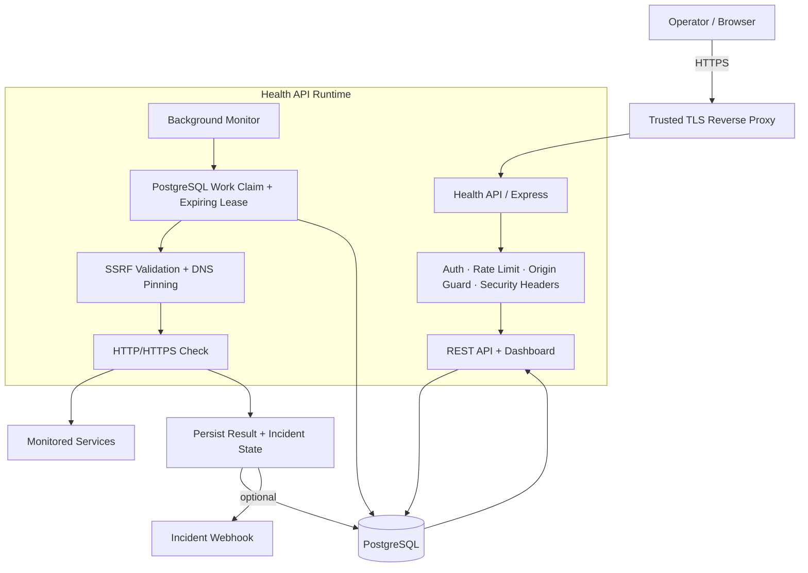
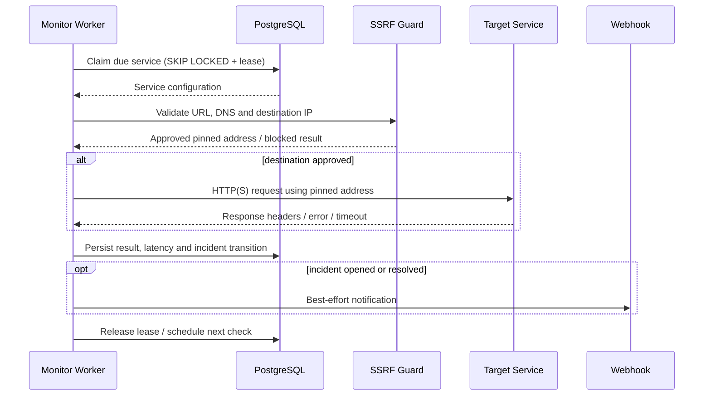

<div align="center">

# Health API

**Continuous HTTP/HTTPS service monitoring with a web dashboard, PostgreSQL-backed history, incident tracking, and production-focused security controls.**


[🇮🇷 فارسی](README-FA.md) · [🌍 English](README.md)

</div>

## Dashboard

The original project dashboard is preserved. Health API supports both dark and light themes.

<p align="center">
  <table>
    <tr>
      <td align="center" width="50%">
        <strong>Dark mode</strong><br>
        
      </td>
      <td align="center" width="50%">
        <strong>Light mode</strong><br>
        
      </td>
    </tr>
  </table>
</p>

## Why Health API?

A health-check endpoint is easy to build. A monitoring service that stays safe and useful in production is harder.

Health API is designed around that gap:

- checks services continuously instead of only on demand;
- stores status, latency, history, and incidents in PostgreSQL;
- avoids duplicate work across multiple application instances;
- treats monitored URLs as untrusted input and defends against SSRF and DNS rebinding;
- separates cached status reads from live outbound checks;
- exposes liveness, readiness, metrics, structured logs, and incident notifications;
- ships with CI, CodeQL, Docker hardening, migrations, runbooks, ADRs, and a threat model.

## Architecture at a glance



The important design rule is that the dashboard reads **persisted state**. It does not trigger a live outbound request for every rendered service.

For the complete architecture, deployment, incident, CI/CD, and state diagrams, see **[docs/DIAGRAMS.md](docs/DIAGRAMS.md)**.

## Monitoring lifecycle



## What is included?

| Area | Implementation |
|---|---|
| Monitoring | Background scheduler, bounded concurrency, manual checks |
| Coordination | PostgreSQL `FOR UPDATE SKIP LOCKED` + expiring service leases |
| History | Persistent health results, status codes, latency and retention |
| Incidents | Failure threshold, one-open-incident invariant, open/resolve lifecycle |
| Security | Basic Auth, rate limiting, mutation origin guard, CSP/security headers |
| SSRF defense | HTTP(S)-only, special/private IP blocking, redirect re-validation, DNS pinning |
| Operations | `/live`, `/ready`, `/metrics`, JSON logs, request IDs, graceful shutdown |
| Delivery | Docker hardening, Compose isolation, CI, CodeQL, Dependabot, GHCR publishing |
| Documentation | Architecture, Design Doc, Threat Model, Runbook, ADRs, Persian README |

## Quick start

Copy the environment template:

```bash
cp .env.example .env
```

Set strong values at minimum:

```text
DB_PASSWORD=<long-random-database-password>
ADMIN_USERNAME=admin
ADMIN_PASSWORD=<at-least-16-characters>
```

Start the stack:

```bash
docker compose up -d --build
```

Open:

```text
http://localhost:3000/dashboard
```

For a real production deployment, terminate TLS at a trusted reverse proxy/load balancer. Do not expose Basic Auth over plaintext HTTP on an untrusted network.

## Core API

### Operational endpoints

```http
GET /live
GET /ready
GET /health
GET /metrics
```

`/live` checks the Node process. `/ready` checks PostgreSQL connectivity. `/health` is a compatibility alias for readiness. `/metrics` is authenticated.

### Services

```http
GET    /services?limit=100&offset=0&search=payments
POST   /services
GET    /services/:id
PATCH  /services/:id
DELETE /services/:id
```

Example service:

```json
{
  "name": "Payments API",
  "url": "https://payments.example.com/health",
  "intervalSeconds": 60,
  "timeoutMs": 5000,
  "expectedStatus": 200,
  "enabled": true
}
```

### Status, checks, history and incidents

```http
GET  /services/:id/health
POST /services/:id/check
GET  /services/:id/history?limit=100
GET  /services/:id/incidents?limit=50
```

`GET /services/:id/health` returns the last persisted monitoring result and creates **no outbound traffic**. Use `POST /services/:id/check` for an immediate live check.

## Security model

Public internet targets are allowed by default. Loopback, private, link-local, metadata-style, multicast, documentation, and other special-use IPv4/IPv6 destinations are blocked unless an explicit policy allows them.

Every redirect is validated as a new destination, and outbound connections are pinned to the address that passed validation to reduce DNS-rebinding risk.

For selected internal hosts:

```text
TARGET_ALLOWLIST=api.internal.example,*.svc.example
```

See [SECURITY.md](SECURITY.md) and [docs/THREAT_MODEL.md](docs/THREAT_MODEL.md) before exposing the service outside a trusted development environment.

## Documentation map

| Document | Purpose |
|---|---|
| [README-FA.md](README-FA.md) | Persian project guide |
| [docs/DIAGRAMS.md](docs/DIAGRAMS.md) | Complete Mermaid map of runtime, data, incidents, deployment and CI/CD |
| [docs/ARCHITECTURE.md](docs/ARCHITECTURE.md) | Architecture and component boundaries |
| [docs/DESIGN.md](docs/DESIGN.md) | Design goals, invariants and trade-offs |
| [docs/THREAT_MODEL.md](docs/THREAT_MODEL.md) | Assets, trust boundaries, threats and residual risk |
| [docs/OPERATIONS.md](docs/OPERATIONS.md) | Deployment and incident-response runbook |
| [docs/adr/README.md](docs/adr/README.md) | Architecture Decision Records |
| [docs/PRODUCTION.md](docs/PRODUCTION.md) | Production deployment requirements |
| [docs/PRODUCTION_READINESS.md](docs/PRODUCTION_READINESS.md) | Readiness assessment and remaining deployment gates |
| [CONTRIBUTING.md](CONTRIBUTING.md) | Contribution workflow |
| [CHANGELOG.md](CHANGELOG.md) | Notable changes |

## Local development

```bash
npm ci
AUTH_DISABLED=true MONITOR_ENABLED=false npm start
```

Production startup rejects `AUTH_DISABLED=true`.

## Tests and quality

```bash
npm run lint
npm run format:check
npm test
```

Pull-request CI runs linting, PostgreSQL-backed tests, a production dependency audit, and a Docker image build. CodeQL runs in parallel. After merge to `main`, validated images are tagged with the commit SHA and `latest` before publication to GHCR.

## Project structure

```text
health-api/
├── .github/
├── db/
│   ├── migrations/
│   └── schema.sql
├── docs/
│   ├── adr/
│   ├── screenshots/
│   ├── ARCHITECTURE.md
│   ├── DESIGN.md
│   ├── DIAGRAMS.md
│   ├── OPERATIONS.md
│   ├── PRODUCTION.md
│   ├── PRODUCTION_READINESS.md
│   └── THREAT_MODEL.md
├── frontend/
├── src/
├── README.md
├── README-FA.md
├── SECURITY.md
├── CONTRIBUTING.md
├── CHANGELOG.md
├── Dockerfile
└── docker-compose.yml
```

## Contributing

Contributions are welcome. Read [CONTRIBUTING.md](CONTRIBUTING.md) before opening a pull request. Security-sensitive changes should preserve the invariants documented in the ADRs and threat model.

## License

The repository declares the **ISC License**. See [LICENSE](LICENSE).
