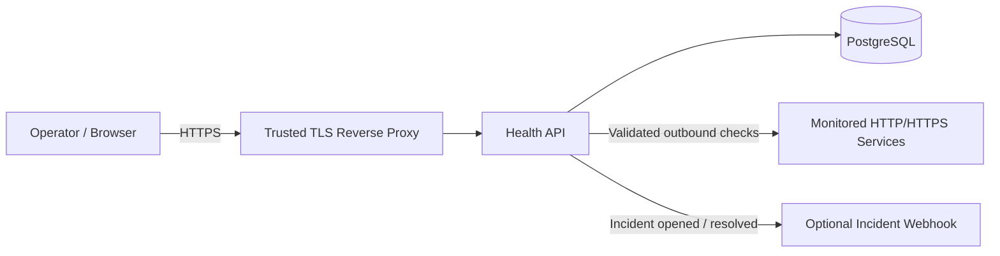
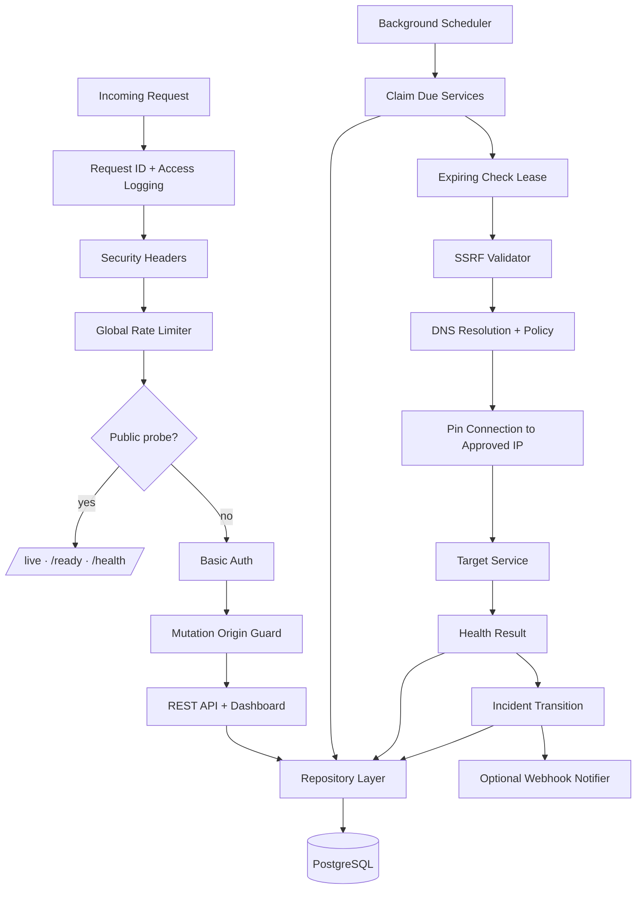
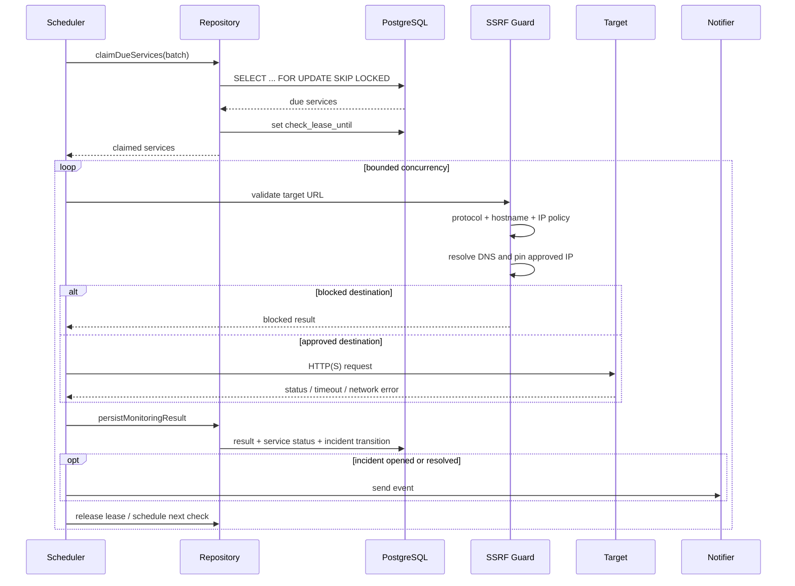
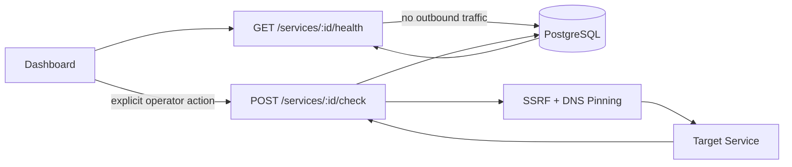
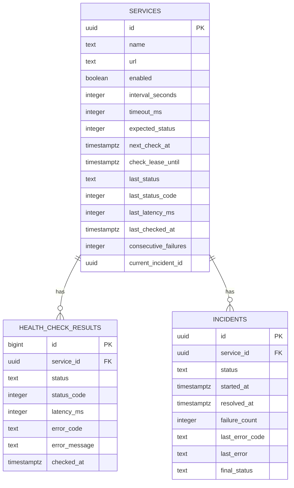
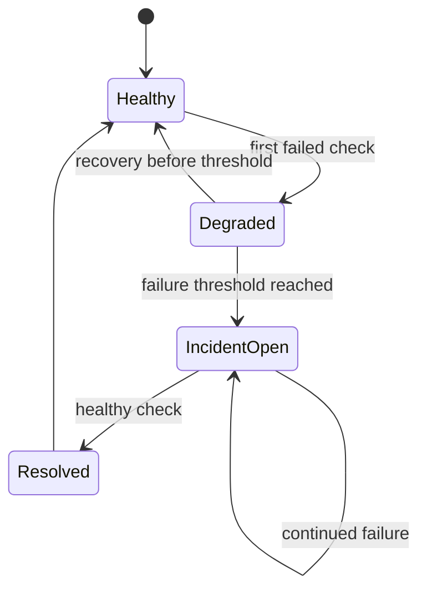
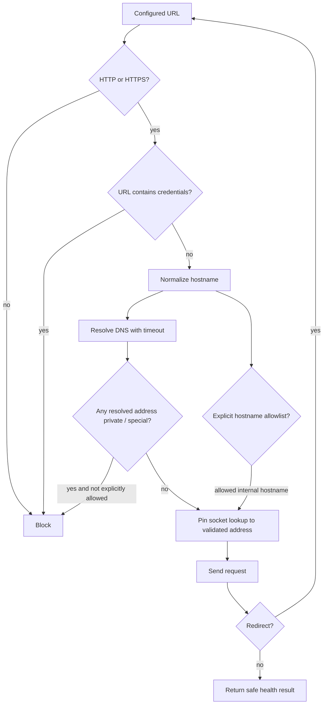
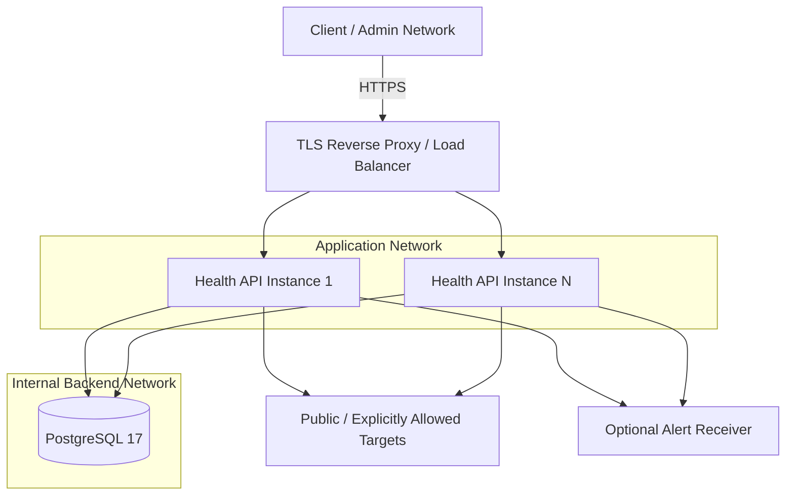
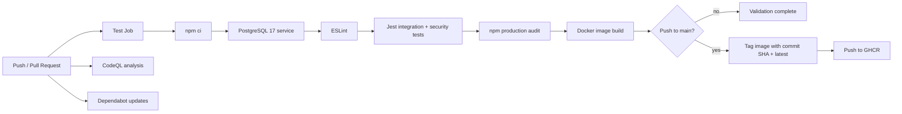
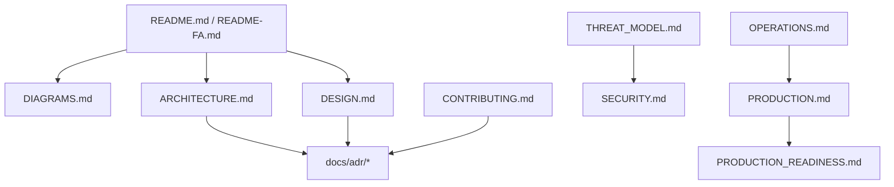

# Health API — Diagram Map

This document is the visual map of the project. All diagrams use Mermaid so they render directly in GitHub without generated image assets.

## 1. System context

## 2. Runtime architecture

## 3. Monitoring check lifecycle

## 4. Manual check versus cached status

The cached GET path is intentionally side-effect free. Only the explicit POST path performs a live network check.

## 5. Data model

## 6. Incident state machine

The implementation keeps at most one open incident per service.

## 7. SSRF decision path

Every redirect re-enters the same validation pipeline.

## 8. Deployment topology

PostgreSQL is the coordination point for work claims and service leases. If multiple public-facing API replicas are used, rate limiting should also move to a shared external store or gateway.

## 9. CI/CD flow

## 10. Documentation relationships

## Related documents

- [Architecture](ARCHITECTURE.md)
- [Design document](DESIGN.md)
- [Threat model](THREAT_MODEL.md)
- [Operations runbook](OPERATIONS.md)
- [Production guide](PRODUCTION.md)
- [Production readiness](PRODUCTION_READINESS.md)
- [ADR index](adr/README.md)
